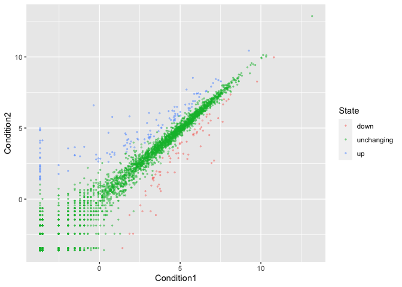
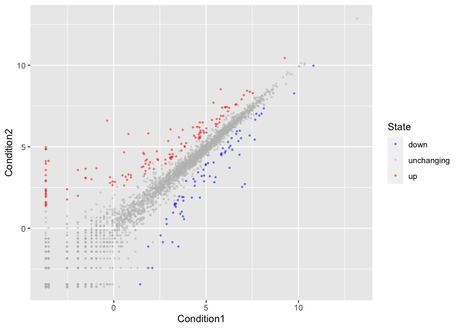
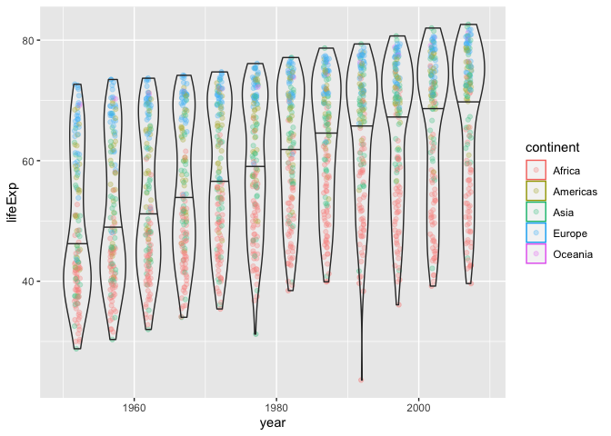

Class 05: Data Visualization
================
Shitian Li (PID: A13294481)
12/3/2021

``` r
# Class 05: Data Visualization 
# Trying the ggplot2 package

# First, install and load required packages: 
# install.packages("ggplot2")
library(ggplot2)

# we'll try with inbuild cars dataset
ggplot(cars) +
  aes(x=speed, y=dist) +
  geom_point() +
  geom_smooth(method = "lm") +
  labs(title = "Stopping Distance of Old Cars", 
       x = "Speed (MPH)", 
       y = "Stopping Distance (ft)")
```

    ## `geom_smooth()` using formula 'y ~ x'

<!-- -->

``` r
# side note: R has in-built plotting
plot(cars)
```

<!-- -->

``` r
# import gene expression data
url <- "https://bioboot.github.io/bimm143_S20/class-material/up_down_expression.txt"
genes <- read.delim(url)
head(genes)
```

    ##         Gene Condition1 Condition2      State
    ## 1      A4GNT -3.6808610 -3.4401355 unchanging
    ## 2       AAAS  4.5479580  4.3864126 unchanging
    ## 3      AASDH  3.7190695  3.4787276 unchanging
    ## 4       AATF  5.0784720  5.0151916 unchanging
    ## 5       AATK  0.4711421  0.5598642 unchanging
    ## 6 AB015752.4 -3.6808610 -3.5921390 unchanging

``` r
# Q. How many genes?
nrow(genes)
```

    ## [1] 5196

``` r
# Q. How many genes are up-regulated? 
table(genes$State)
```

    ## 
    ##       down unchanging         up 
    ##         72       4997        127

``` r
# Q. What percentage is up?
round(table(genes$State) / nrow(genes) * 100, 2)
```

    ## 
    ##       down unchanging         up 
    ##       1.39      96.17       2.44

``` r
# Let's make a figure
p <- ggplot(genes, aes(Condition1, Condition2, col=State)) +
  geom_point(alpha = 0.4, size = 0.5)
p
```

<!-- -->

``` r
# change color scheme
p + scale_color_manual(values = c("blue", "grey", "red"))
```

<!-- -->

``` r
# Let's explore thegapminder dataset
# install.packages("gapminder")
library(gapminder)
head(gapminder)
```

    ## # A tibble: 6 × 6
    ##   country     continent  year lifeExp      pop gdpPercap
    ##   <fct>       <fct>     <int>   <dbl>    <int>     <dbl>
    ## 1 Afghanistan Asia       1952    28.8  8425333      779.
    ## 2 Afghanistan Asia       1957    30.3  9240934      821.
    ## 3 Afghanistan Asia       1962    32.0 10267083      853.
    ## 4 Afghanistan Asia       1967    34.0 11537966      836.
    ## 5 Afghanistan Asia       1972    36.1 13079460      740.
    ## 6 Afghanistan Asia       1977    38.4 14880372      786.

``` r
# Let's make a new plot of year vs. lif exp
ggplot(gapminder, aes(year, lifeExp, col=continent)) + 
  geom_jitter(alpha=0.3, width=0.4) +
  geom_violin(aes(group=year), alpha = 0.2, 
              draw_quantiles = 0.5)
```

<!-- -->

``` r
# install the plotly
# install.packages("plotly")
# library(plotly)
# ggplotly()
```
