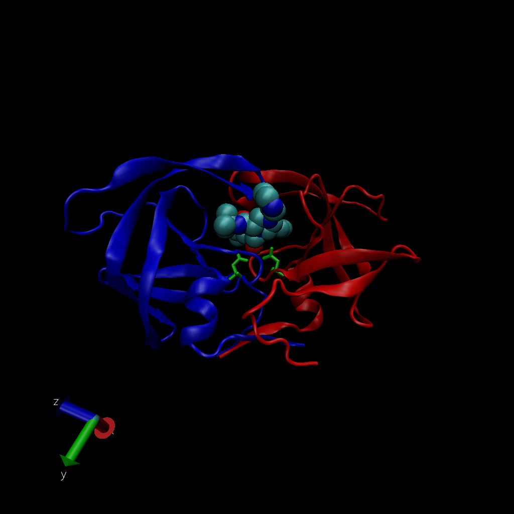

## Load data

```{r}
PDB.data <- read.csv("~/OneDrive/GradClass/BGGN 213 Bioinfo/R/BGGN213/class11/Data Export Summary.csv")
row.names(PDB.data) <- PDB.data$Molecular.Type
PDB.data <- PDB.data[, -1]
PDB.data
```

> Q1: What percentage of structures in the PDB are solved by X-Ray and Electron Microscopy.

```{r}
Xray.perc <- round(sum(PDB.data$X.ray) / sum(PDB.data$Total), 3) * 100
Em.perc <- round(sum(PDB.data$EM) / sum(PDB.data$Total), 3) * 100
print(paste("The X ray percentage is", Xray.perc))
print(paste("The EM percentage is", Em.perc))
```

> Q2: What proportion of structures in the PDB are protein?

```{r}
round(sum(PDB.data$Total[1])/sum(PDB.data$Total), 4) * 100
```

> Q3: Type HIV in the PDB website search box on the home page and determine how many HIV-1 protease structures are in the current PDB?

**1817**

## Import HSV1 Jpeg



## Using Bio3D in R for structural bioinformatics

Do a Normal Mode Analysis (NMA), a prediction of the conformational variability and intrinsicdynamics of this protein. 
```{r}
library(bio3d)

pdb <- read.pdb("1hel")
pdb
```

```{r}
head(pdb$atom)
```

```{r}
m <- nma(pdb)
plot(m)
```
Make a little movie (trajectory) for viewing in VMD. 
```{r}
mktrj(m, file="nma.pdb")
```

