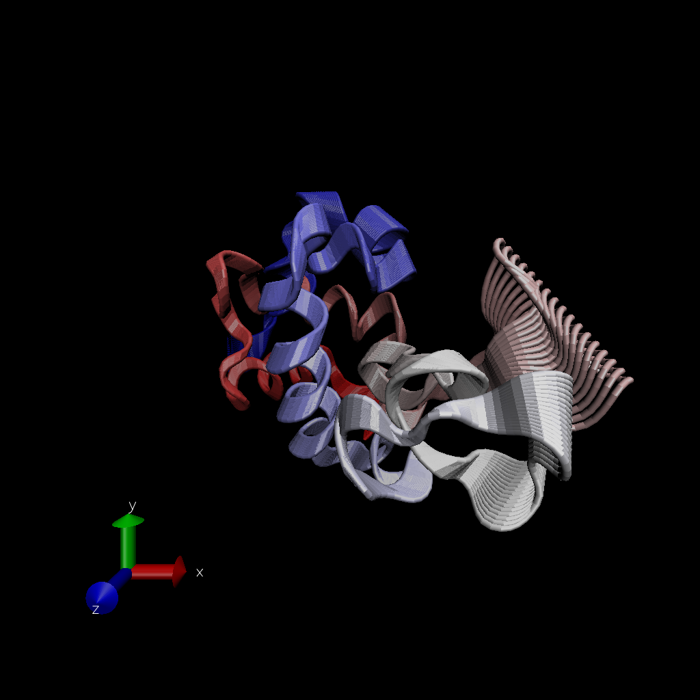

# Working with bio3d

```{r message=FALSE, warning=FALSE}
library(bio3d)

pdb <- read.pdb("1hel")
pdb
```

```{r}
head(pdb$atom)
```

Let's do a quick bioinformatics prediction of protein dynamics (flexibility). We use the `nma()` function, which does normal mode analysis.

```{r}
modes <- nma(pdb)
plot(modes)
```

Make a trajectory of this prediction with the `mktrj()`:

```{r}
mktrj(modes, file = "nma.pdb")
```

And the image from VMD:



# Comparative Structure Analysis

Start by getting a sequence of interest. 

```{r}
aa <- get.seq("1AKE_A")
aa
```

```{r}
# blast <- blast.pdb(aa)
```

```{r}
# hits <- plot(blast)
hits <- NULL
hits$pdb.id <- c('1AKE_A','4X8M_A','6S36_A','6RZE_A','4X8H_A','3HPR_A','1E4V_A','5EJE_A','1E4Y_A','3X2S_A','6HAP_A','6HAM_A','4K46_A','4NP6_A','3GMT_A','4PZL_A')
```

Now I have my top hits from the search of the PDB
```{r}
hits$pdb.id
```

Here we download all these similar structures in the PDB and store them on our computer. 

```{r message=FALSE, warning=FALSE}
# Download related PDB files
files <- get.pdb(hits$pdb.id, path="pdbs", split=T, gzip=T)
```

Now we want to align all these structures. We will use the function `pdbaln()`

```{r}
pdbs <- pdbaln(files, fit=T)
```

Let's have a look: 
```{r}
pdbs
```

# Principal Component Analysis

Here we will do PCA on the xyz coordinate data of all these structures with the `pca()` function in bio3d.

```{r}
pc <- pca(pdbs)
plot(pc)
```

Let's visualize the displacements (i.e. movements of the structure) that are captured by PC1

```{r}
mktrj(pc, pc=1, file="pca.pdb")
```

Let's save our important results

```{r}
# save(blast, hits, pca, pdbs, file="myresults.RData")
# load("myresults.RData")
```


