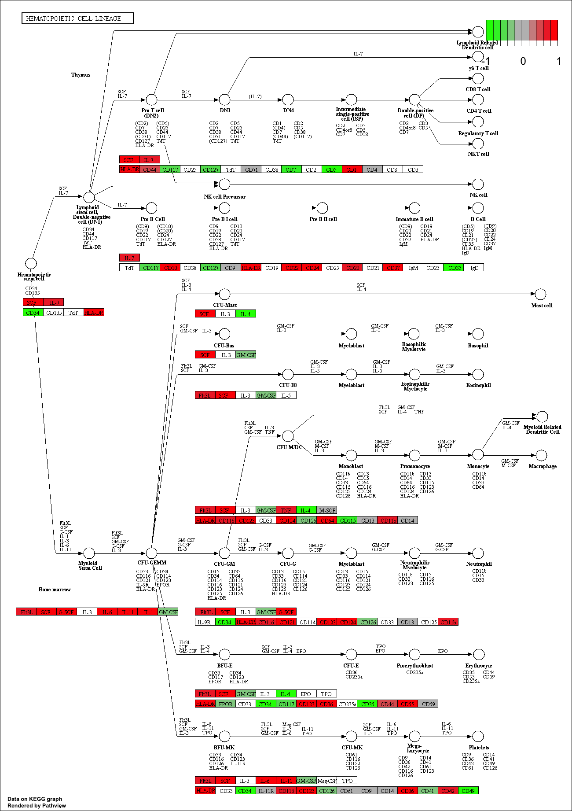
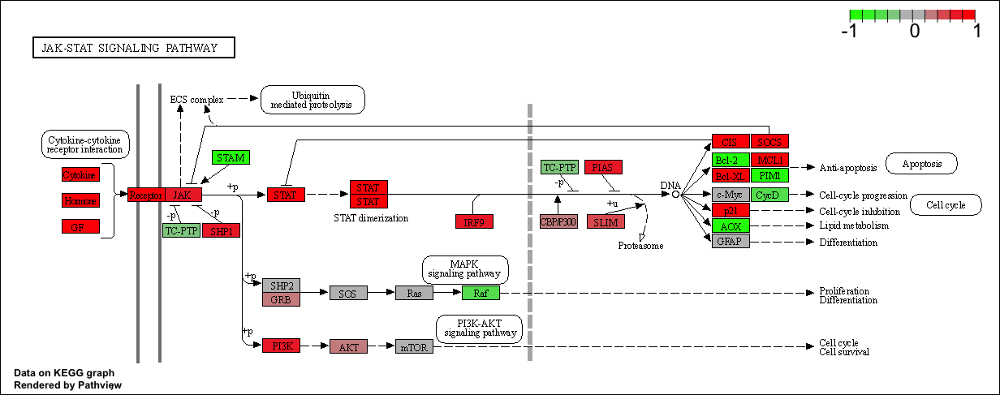
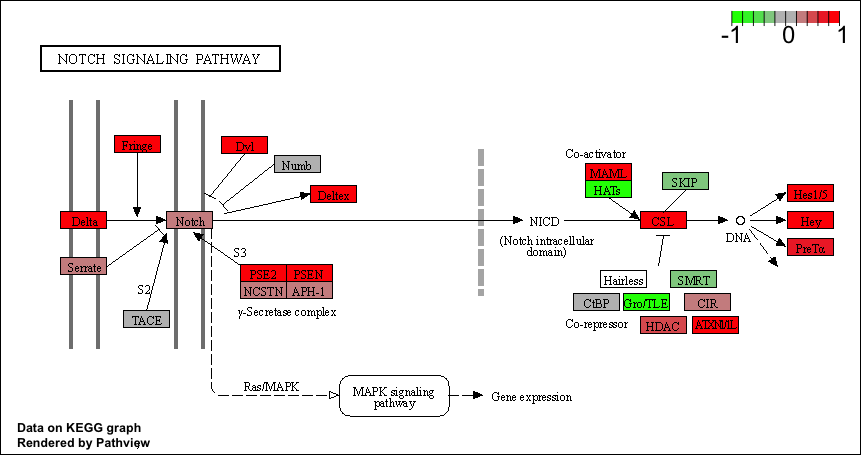
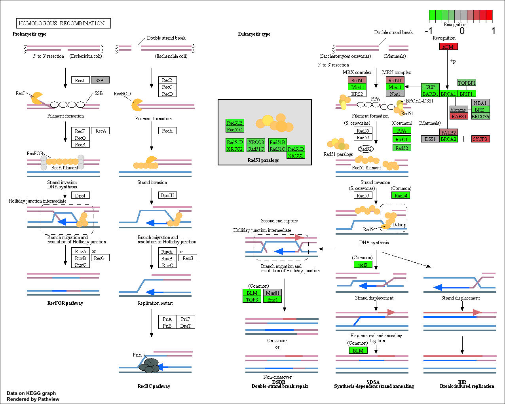

# 1. Data Import

Load the required libraries:

```{r, include=F}
library(DESeq2)
```

Import useful data:

```{r}
metaFile <- "GSE37704_metadata.csv"
countFile <- "GSE37704_featurecounts.csv"

# Import metadata and take a peak
colData = read.csv(metaFile, row.names=1)
head(colData)
```

```{r}
# Import countdata
countData = read.csv(countFile, row.names=1)
head(countData)
```

Note we need to remove the odd first length column:

```{r}
countData <- as.matrix(countData[,-1])
head(countData)
```

Also, we have too many entries with 0 value. Remove them.

```{r}
# Filter count data where you have 0 read count across all samples.
countData = countData[rowSums(countData) != 0, ]
head(countData)
```

# 2. PCA for Quality Control

I am going to use the base R `prcomp()` function for PCA of our counts data (from which I have removed the zero count genes)

```{r}
pca <- prcomp(t(countData))
summary(pca)
```

```{r}
plot(pca$x[,1:2], col=as.factor(colData$condition), pch=16)
text(pca$x[,1:2], labels=colData$condition)
```

```{r}
library(ggplot2)
x <- as.data.frame(pca$x)
x$condition <- colData$condition

ggplot(x) + 
  aes(PC1, PC2, col=condition) +
  geom_point()
```

# 3. DESeq analysis

```{r}
dds = DESeqDataSetFromMatrix(countData=countData,
                             colData=colData,
                             design=~condition)
dds = DESeq(dds)
```

```{r}
dds
```

```{r}
res = results(dds)
```

```{r}
summary(res)
```

# 4. Volcano plot

```{r}
plot( res$log2FoldChange, -log(res$padj) )
```

```{r}
# Make a color vector for all genes
mycols <- rep("gray", nrow(res) )

# Color red the genes with absolute fold change above 2
mycols[ abs(res$log2FoldChange) > 2 ] <- "red"

# Color blue those with adjusted p-value less than 0.01
#  and absolute fold change more than 2
inds <- (res$pvalue < 0.01) & (abs(res$log2FoldChange) > 2 )
mycols[ inds ] <- "blue"

plot( res$log2FoldChange, -log(res$padj), col=mycols, xlab="Log2(FoldChange)", ylab="-Log(P-value)" )
```

# 5. Annotation

```{r}
library("AnnotationDbi")
library("org.Hs.eg.db")

columns(org.Hs.eg.db)
```

```{r}

res$symbol = mapIds(org.Hs.eg.db,
                    keys=row.names(res), 
                    keytype="ENSEMBL",
                    column="SYMBOL",
                    multiVals="first")

res$entrez = mapIds(org.Hs.eg.db,
                    keys=row.names(res),
                    keytype="ENSEMBL",
                    column="ENTREZID",
                    multiVals="first")

res$name =   mapIds(org.Hs.eg.db,
                    keys=row.names(res),
                    keytype="ENSEMBL",
                    column="GENENAME",
                    multiVals="first")

head(res, 10)
```

```{r}
res = res[order(res$pvalue),]
write.csv(res, "deseq_results.csv")
```

# 6. Pathway Analysis

```{r}
library(pathview)
```

```{r}
library(gage)
library(gageData)

data(kegg.sets.hs)
data(sigmet.idx.hs)

# Focus on signaling and metabolic pathways only
kegg.sets.hs = kegg.sets.hs[sigmet.idx.hs]

# Examine the first 3 pathways
head(kegg.sets.hs, 3)
```

```{r}
foldchanges = res$log2FoldChange
names(foldchanges) = res$entrez
head(foldchanges)
```

```{r}
# Get the results
keggres = gage(foldchanges, gsets=kegg.sets.hs)
```

```{r}
attributes(keggres)
```

```{r}
# Look at the first few down (less) pathways
head(keggres$less)
```

```{r}
pathview(gene.data=foldchanges, pathway.id="hsa04110")
```


## Top 5 upregulated genes

```{r}
## Focus on top 5 upregulated pathways here for demo purposes only
keggrespathways <- rownames(keggres$greater)[1:5]

# Extract the 8 character long IDs part of each string
keggresids = substr(keggrespathways, start=1, stop=8)
keggresids
```

```{r}
pathview(gene.data=foldchanges, pathway.id=keggresids, species="hsa")
```








## Top 5 downregulated genes

```{r}
## Focus on top 5 downregulated pathways here for demo purposes only
keggrespathways <- rownames(keggres$less)[1:5]

# Extract the 8 character long IDs part of each string
keggresids = substr(keggrespathways, start=1, stop=8)
keggresids
```

```{r}
pathview(gene.data=foldchanges, pathway.id=keggresids, species="hsa")
```





